# 数智农旅平台 - 微信小程序版

## 项目结构

miniprogram/
├── src/
│   ├── pages/              # 页面目录
│   │   ├── user/          # 用户相关页面
│   │   ├── shop/          # 商城相关页面
│   │   ├── live/          # 直播相关页面
│   │   ├── course/        # 课程相关页面
│   │   ├── tour/          # 景点相关页面
│   │   └── admin/         # 管理后台页面
│   ├── api/               # API 接口封装
│   ├── utils/             # 工具函数
│   ├── components/        # 公共组件
│   ├── static/            # 静态资源
│   ├── App.vue           # 应用入口
│   ├── main.ts           # 入口文件
│   ├── manifest.json     # 应用配置
│   └── pages.json        # 页面路由配置
├── package.json
└── vite.config.ts
```

## 快速开始

### 1. 安装依赖

```bash
cd miniprogram
npm install
```

### 2. 运行到微信开发者工具

```bash
npm run dev:mp-weixin
```

### 3. 在微信开发者工具中打开

- 打开微信开发者工具
- 导入项目，选择 `miniprogram/dist/dev/mp-weixin` 目录
- 在小程序管理后台配置合法域名（开发环境可跳过）

## 已实现功能

### 用户端
- ✅ **用户体系**: 登录/注册、个人中心、地址管理（预留）
- ✅ **商城系统**: 
  - 商品列表（搜索、分类）
  - 商品详情
  - 购物车（增删改查）
  - 订单流程（下单、支付模拟、状态流转）
- ✅ **直播带货**: 
  - 直播列表（状态筛选）
  - 直播间（视频播放、弹幕互动模拟、商品橱窗）
- ✅ **在线课堂**: 
  - 课程列表（分类筛选）
  - 课程详情
- ✅ **乡村云游**: 
  - 景点列表（评分、价格）
  - 景点详情
- ✅ **AI 智能助手** (New):
  - 智能问答（预留 LLM 接口）
  - 拍照诊断（预留图像识别接口）
  - 行情分析/游玩攻略（规划中）

### 管理后台（精简版）
- ✅ 数据概览
- ⏳ 商品管理
- ⏳ 订单管理

## 技术栈

- **框架**: uni-app + Vue 3 + TypeScript
- **UI 组件**: uView Plus
- **构建工具**: Vite
- **后端**: FastAPI (复用现有后端)

## 后端 API 配置

修改 `src/utils/request.ts` 中的 `BASE_URL` 为实际后端地址：

```typescript
const BASE_URL = 'http://127.0.0.1:8000/api/v1'
```

生产环境请改为正式服务器地址。

## 注意事项

1. 需要在小程序管理后台配置服务器域名
2. 部分功能需要用户授权（如地理位置）
3. 微信支付需要额外配置商户号

## 测试与部署

本项目包含基础的单元测试配置（待完善），建议在部署前运行全量测试。
生产环境构建：
```bash
npm run build:mp-weixin
```

# 数智农旅小程序 - 完整功能架构

## 一、系统架构总览

```mermaid

graph TD

A[数智农旅平台] --> B[游客端]

A --> C[农民端]

A --> D[管理员端]

A --> E[公共基础服务]

A --> F[AI智能服务中心]

A --> G[后台管理系统]

B --> B1[首页发现]

B --> B2[农产品商城]

B --> B3[直播广场]

B --> B4[乡村云游]

B --> B5[农技课堂]

B --> B6[AI村庄助手]

B --> B7[个人中心]

C --> C1[包含游客所有功能]

C --> C2[我的土地]

C --> C3[农产品管理]

C --> C4[直播中心]

C --> C5[数据中心]

C --> C6[收益管理]

C --> C7[AI农技助手]

D --> D1[包含农民所有功能]

D --> D2[内容审核]

D --> D3[课程管理]

D --> D4[用户管理]

D --> D5[平台运营]

D --> D6[数据大屏]

D --> D7[AI知识库管理]

E --> E1[用户认证]

E --> E2[支付系统]

E --> E3[消息通知]

E --> E4[文件存储]

E --> E5[搜索服务]

F --> F1[图像识别引擎]

F --> F2[自然语言处理]

F --> F3[知识图谱]

F --> F4[推荐算法]

G --> G1[商品管理]

G --> G2[订单管理]

G --> G3[财务管理]

G --> G4[数据统计]

G --> G5[系统配置]

```



---

## 二、角色权限矩阵

| 功能模块 | 游客 | 农民 | 管理员 |

|---------|:--:|:--:|:--:|

| 浏览商城/直播/云游/课堂 | ✓ | ✓ | ✓ |

| 下单购买 | ✓ | ✓ | ✓ |

| 收藏/评论/分享 | ✓ | ✓ | ✓ |

| AI村庄助手 | ✓ | ✓ | ✓ |

| 土地管理 | ✗ | ✓ | ✓ |

| 商品上架/直播开播 | ✗ | ✓ | ✓ |

| AI农技助手 | ✗ | ✓ | ✓ |

| 收益提现 | ✗ | ✓ | ✓ |

| 内容审核 | ✗ | ✗ | ✓ |

| 课程上传 | ✗ | ✗ | ✓ |

| 用户管理 | ✗ | ✗ | ✓ |

| 平台运营配置 | ✗ | ✗ | ✓ |

| 数据大屏 | ✗ | ✗ | ✓ |

| AI知识库管理 | ✗ | ✗ | ✓ |

---

## 三、游客端功能详单

### 3.1 首页发现

| 功能点 | 说明 |

|--------|------|

| 轮播Banner | 活动推广、特色农产品、直播预告 |

| 快捷入口 | 商城、直播、云游、课堂、AI助手 |

| 推荐商品 | 基于浏览历史的个性化推荐 |

| 热门直播 | 正在直播/即将开播的直播间 |

| 附近村庄 | 基于定位推荐周边乡村旅游 |

| 搜索功能 | 商品/直播/课程/景点全局搜索 |

### 3.2 农产品商城

| 功能点 | 说明 |

|--------|------|

| 商品分类 | 水果蔬菜、粮油干货、畜禽水产、农副加工 |

| 商品列表 | 筛选（价格/销量/新品）、排序 |

| 商品详情 | 图文详情、规格选择、库存显示、农民店铺 |

| 购物车 | 添加/删除、数量调整、批量结算 |

| 订单管理 | 待付款/待发货/待收货/已完成/退款售后 |

| 物流跟踪 | 对接快递100实时查询 |

| 评价系统 | 商品评价、晒单、追评 |

| 收藏商品 | 我的收藏列表 |

| 优惠券 | 领券中心、我的优惠券 |

### 3.3 直播广场

| 功能点 | 说明 |

|--------|------|

| 直播列表 | 直播中/预告/回放分类 |

| 直播间 | 视频播放、弹幕互动、商品橱窗、在线下单 |

| 直播预约 | 预约开播提醒 |

| 直播回放 | 历史直播回看 |

| 主播关注 | 关注农民主播、开播提醒 |

| 礼物打赏 | 虚拟礼物互动（可选） |

### 3.4 乡村云游

| 功能点 | 说明 |

|--------|------|

| 景点列表 | 分类筛选（自然风光/人文古迹/农事体验） |

| 景点详情 | 图文介绍、VR全景、导航、周边推荐 |

| VR全景 | 360°沉浸式村庄游览 |

| 农事体验预约 | 采摘、插秧、收割等体验活动预约 |

| 民宿预订 | 查看房型、价格、空房、在线预订 |

| 游玩攻略 | 推荐路线、行程规划 |

| 打卡签到 | 景点打卡、生成分享海报 |

### 3.5 农技课堂

| 功能点 | 说明 |

|--------|------|

| 课程分类 | 种植技术/养殖技术/农机使用/经营管理 |

| 课程列表 | 免费/付费、热门/最新筛选 |

| 课程详情 | 课程介绍、讲师信息、目录、评价 |

| 视频学习 | 在线播放、倍速、断点续播 |

| 学习记录 | 已学课程、学习进度 |

| 课后测试 | 选择题测试、获得学习证书 |

| 收藏课程 | 我的课程收藏 |

| 农技问答 | 课程相关问答社区 |

### 3.6 AI村庄助手

| 功能点 | 说明 |

|--------|------|

| 智能问答 | 文字/语音提问村庄相关问题 |

| 村庄百科 | 村史文化、特色产业、风土人情 |

| 景点推荐 | 根据偏好/时间推荐游玩路线 |

| 农产品咨询 | 产品特点、产地故事、购买建议 |

| 攻略生成 | AI生成个性化游玩攻略 |

| 智能客服 | 订单/预约/导航问题自动解答 |

### 3.7 个人中心

| 功能点 | 说明 |

|--------|------|

| 账号管理 | 注册/登录/密码修改/绑定手机 |

| 我的订单 | 全部订单、待付款、待发货、待收货、退款售后 |

| 我的收藏 | 商品/课程/景点收藏 |

| 浏览历史 | 最近浏览记录 |

| 地址管理 | 收货地址增删改查 |

| 我的优惠券 | 可用/已用/已过期 |

| 客服中心 | 在线客服、常见问题、意见反馈 |

| 设置 | 消息通知、隐私设置、关于我们 |

| 切换身份 | 申请成为农民（提交认证） |

---

## 四、农民端功能详单（含游客全部功能）

### 4.1 我的土地

| 功能点 | 说明 |

|--------|------|

| 土地档案 | 地块信息、面积、位置、土壤类型 |

| 土地绑定 | 上传土地证明、管理员审核 |

| 环境监测 | 土壤湿度/温度/pH值、空气湿度/温度 |

| 数据看板 | 历史数据曲线、对比分析 |

| 预警提醒 | 异常数据推送、天气灾害预警 |

| 农事记录 | 播种/施肥/浇水/除草/收获记录 |

| 生长周期 | 作物生长阶段追踪、预计收获时间 |

| IoT设备 | 传感器绑定、设备状态管理 |

### 4.2 农产品管理

| 功能点 | 说明 |

|--------|------|

| 商品发布 | 上传图片、填写信息、设置价格库存 |

| 商品编辑 | 修改信息、上下架、删除 |

| 库存管理 | 实时库存、库存预警 |

| 订单处理 | 确认订单、发货、处理退款 |

| 物流管理 | 填写物流单号、物流跟踪 |

| 售后管理 | 处理退货退款申请 |

| 评价回复 | 回复买家评价 |

| 销售统计 | 日/周/月销售数据、热销排行 |

### 4.3 直播中心

| 功能点 | 说明 |

|--------|------|

| 开播准备 | 选择直播商品、设置封面标题 |

| 开启直播 | 推流开播、美颜滤镜 |

| 直播管理 | 商品讲解、弹幕互动、禁言管理 |

| 直播数据 | 观看人数、互动数据、销售转化 |

| 直播回放 | 回放视频管理 |

| 粉丝管理 | 粉丝列表、粉丝画像 |

| 直播预约 | 预约未来直播时段 |

### 4.4 数据中心

| 功能点 | 说明 |

|--------|------|

| 销售概览 | 销售额、订单量、客单价趋势 |

| 商品分析 | 浏览量/转化率/复购率 |

| 直播分析 | 观看数据/互动数据/带货数据 |

| 土地数据 | 环境监测统计、作物生长报告 |

| 学习进度 | 已学课程、学习时长、获得证书 |

| 粉丝分析 | 粉丝增长、活跃粉丝、粉丝画像 |

| 收入分析 | 收入来源构成、趋势对比 |

### 4.5 收益管理

| 功能点 | 说明 |

|--------|------|

| 收入明细 | 销售收入、直播打赏、其他收入 |

| 账户余额 | 可用余额、冻结金额 |

| 提现管理 | 绑定银行卡、申请提现、提现记录 |

| 财务报表 | 月度/年度收支报表导出 |

| 对账单 | 交易明细查询、对账 |

### 4.6 AI农技助手

| 功能点 | 说明 |

|--------|------|

| 病虫害识别 | 拍照识别病虫类型、危害程度 |

| 作物健康诊断 | 分析植株图片、评估健康状态 |

| 施肥用药建议 | 根据诊断推荐方案、用药安全提示 |

| 种植方案推荐 | 基于土地数据推荐种植计划 |

| 智能问答 | 农业技术问题文字/语音咨询 |

| 市场行情分析 | 农产品价格走势、供需预测 |

| 灾害预警解读 | 气象预警对作物影响分析 |

| 识别历史 | 历史诊断记录、对比追踪 |

---

## 五、管理员端功能详单（含农民全部功能）

### 5.1 内容审核

| 功能点 | 说明 |

|--------|------|

| 商品审核 | 审核农民上架商品、违规下架 |

| 直播审核 | 直播内容监管、违规断播 |

| 内容举报 | 处理用户举报、违规处罚 |

| 敏感词管理 | 敏感词库维护、自动过滤 |

### 5.2 课程管理

| 功能点 | 说明 |

|--------|------|

| 课程上传 | 视频/图文课程发布 |

| 课程编辑 | 修改课程信息、章节管理 |

| 课程分类 | 分类增删改查 |

| 讲师管理 | 讲师信息维护、权限设置 |

| 学习统计 | 课程学习数据、完课率 |

| 证书管理 | 学习证书模板、发放记录 |

### 5.3 用户管理

| 功能点 | 说明 |

|--------|------|

| 农民认证审核 | 审核农民身份、土地证明 |

| 用户列表 | 游客/农民/管理员列表 |

| 权限管理 | 角色权限配置、功能开关 |

| 用户画像 | 用户行为分析、标签管理 |

| 黑名单 | 违规用户封禁 |

### 5.4 平台运营

| 功能点 | 说明 |

|--------|------|

| Banner管理 | 首页轮播图配置 |

| 活动发布 | 促销活动、满减/秒杀/拼团 |

| 优惠券管理 | 创建/发放/核销优惠券 |

| 公告通知 | 系统公告、推送消息 |

| 积分商城 | 积分规则、兑换商品 |

| 邀请裂变 | 邀请奖励规则、推广海报 |

### 5.5 数据大屏

| 功能点 | 说明 |

|--------|------|

| 实时数据 | 在线用户、正在直播、实时订单 |

| 销售总览 | 平台总销售额、订单量、客单价 |

| 用户分析 | 注册用户、活跃用户、留存率 |

| 商品分析 | 商品数量、品类分布、热销排行 |

| 直播分析 | 直播场次、观看人次、带货GMV |

| 土地数据汇总 | 绑定土地数、监测设备数、数据上报 |

| AI服务统计 | 识别次数、问答次数、满意度 |

| 村庄数据 | 各村庄销售/旅游/学习数据对比 |

### 5.6 AI知识库管理

| 功能点 | 说明 |

|--------|------|

| 病虫害库 | 病虫害信息维护、图片样本管理 |

| 问答语料 | 常见问题库、标准答案维护 |

| 村庄知识库 | 各村介绍、景点、特产信息编辑 |

| 识别模型 | 模型版本管理、准确率监控 |

| 对话配置 | 欢迎语、引导语、转人工设置 |

---

## 六、公共基础服务

| 服务 | 功能说明 |

|------|---------|

| 用户认证 | JWT登录、Token刷新、多端登录管理 |

| 支付系统 | 微信支付集成、分账、退款 |

| 消息通知 | 系统通知、订单通知、营销推送（短信/微信订阅消息） |

| 文件存储 | 图片/视频OSS存储、CDN加速 |

| 搜索服务 | 商品/课程/景点全文检索、搜索建议 |

| 地图服务 | 定位、导航、距离计算 |

| 即时通讯 | 客服聊天、直播弹幕 |

---

## 七、AI智能服务中心

| 引擎 | 功能 |

|------|------|

| 图像识别引擎 | 病虫害识别、作物种类识别、生长阶段判断 |

| 自然语言处理 | 意图识别、语义理解、多轮对话、文本生成 |

| 知识图谱 | 农业知识图谱、村庄信息图谱、农产品知识库 |

| 推荐算法 | 商品推荐、内容推荐、用户画像匹配 |

---

## 八、页面结构总览

```

pages/

├── index/                      # 首页发现

│   └── index.vue

├── shop/                       # 农产品商城

│   ├── index.vue               # 商城首页

│   ├── detail.vue              # 商品详情

│   ├── cart.vue                # 购物车

│   └── order.vue               # 订单管理

├── live/                       # 直播广场

│   ├── index.vue               # 直播列表

│   └── room.vue                # 直播间

├── course/                     # 农技课堂

│   ├── index.vue               # 课程列表

│   └── detail.vue              # 课程详情

├── tour/                       # 乡村云游

│   ├── index.vue               # 景点列表

│   ├── detail.vue              # 景点详情

│   ├── vr.vue                  # VR全景

│   └── booking.vue             # 体验/民宿预订

├── ai/                         # AI助手

│   ├── index.vue               # AI助手首页

│   ├── chat.vue                # 智能问答对话

│   ├── diagnose.vue            # 拍照诊断（农民）

│   ├── market.vue              # 行情分析（农民）

│   └── history.vue             # 历史记录

├── land/                       # 我的土地（农民）

│   ├── index.vue               # 土地列表

│   ├── detail.vue              # 土地详情

│   ├── monitor.vue             # 环境监测

│   └── record.vue              # 农事记录

├── farmer/                     # 农民中心

│   ├── goods.vue               # 商品管理

│   ├── goods-edit.vue          # 商品发布/编辑

│   ├── live-center.vue         # 直播中心

│   ├── live-push.vue           # 直播推流

│   ├── data.vue                # 数据中心

│   └── income.vue              # 收益管理

├── admin/                      # 管理后台

│   ├── dashboard.vue           # 数据大屏

│   ├── audit-goods.vue         # 商品审核

│   ├── audit-live.vue          # 直播审核

│   ├── course-mgr.vue          # 课程管理

│   ├── course-edit.vue         # 课程编辑

│   ├── user-mgr.vue            # 用户管理

│   ├── farmer-audit.vue        # 农民认证审核

│   ├── operation.vue           # 平台运营

│   └── ai-knowledge.vue        # AI知识库

└── user/                       # 个人中心

├── login.vue               # 登录

├── register.vue            # 注册

├── profile.vue             # 个人中心

├── settings.vue            # 设置

├── address.vue             # 地址管理

├── coupon.vue              # 我的优惠券

└── apply-farmer.vue        # 申请成为农民

```

---

## 九、核心业务流程图

### 9.1 农民认证流程

```

用户注册 → 提交认证资料（身份证+土地证明）

→ 管理员审核 → 审核通过获得农民权限

```

### 9.2 商品上架流程

```

农民发布商品 → 填写信息上传图片 → 提交审核

→ 管理员审核通过 → 商品上架销售

```

### 9.3 直播带货流程

```

农民预约直播 → 准备直播商品 → 开播推流

→ 游客观看互动 → 商品讲解下单 → 订单履约

```

### 9.4 AI病虫害诊断流程

```

农民拍照上传 → 图像识别分析 → 返回诊断结果

→ 展示防治方案 → 可一键咨询专家/购买农药

```

### 9.5 游客AI问答流程

```

游客提问 → 意图识别 → 检索知识库

→ 生成回答 → 推荐相关产品/景点 → 引导转化

```

---
